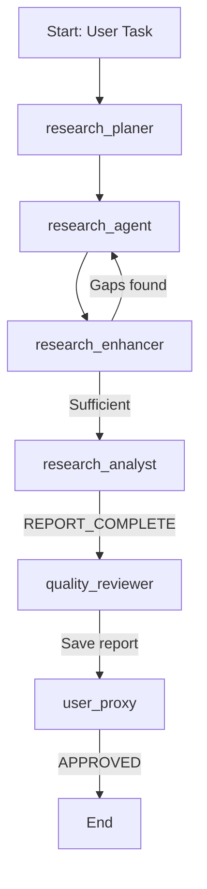
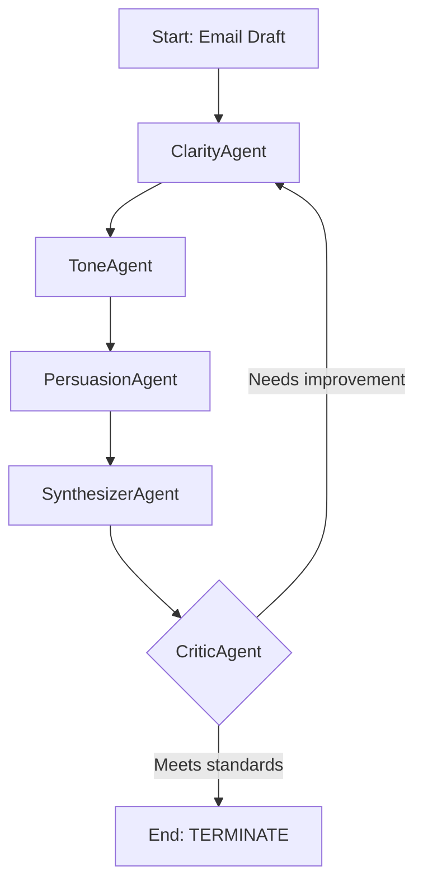

# AutoGen Deep Research (AutoGen을 활용한 심층 리서치 및 이메일 최적화 에이전트)

Microsoft의 AutoGen 프레임워크를 사용하여 두 가지의 독립적인 멀티 에이전트 시스템을 구현한 프로젝트입니다. 하나는 주어진 주제에 대해 심층적인 자율 리서치를 수행하고 보고서를 생성하며, 다른 하나는 전문가 에이전트들의 협업을 통해 이메일 초안을 반복적으로 개선합니다.

## 🚀 핵심 프로젝트

이 저장소는 두 개의 주요 노트북 파일로 구성됩니다.

### 1. 심층 리서치 에이전트 (`deep-research.ipynb`)

- **목표**: 사용자가 입력한 주제에 대해 계획, 리서치, 분석, 검토의 전 과정을 자동화하여 고품질의 리서치 보고서를 생성합니다.
- **핵심 기능**:
  - **동적 에이전트 선택**: `SelectorGroupChat`을 사용하여 정해진 순서가 아닌, 대화의 맥락에 따라 가장 적합한 다음 에이전트를 동적으로 선택합니다.
  - **자동 리서치 및 강화**: 리서치 계획을 수립하고 웹 검색을 수행한 후, 결과물의 허점을 파악하여 추가 리서치를 진행하는 `Enhancer` 에이전트가 포함됩니다.
  - **보고서 생성 및 저장**: 분석가 에이전트가 종합 보고서를 작성하면, 품질 검토 에이전트가 이를 평가하고 최종 결과물을 `.md` 파일로 저장합니다.
  - **인간 참여**: 최종 승인 단계에서 `UserProxyAgent`를 통해 사용자가 개입하여 결과물을 검토하거나 추가 작업을 요청할 수 있습니다.

### 2. 이메일 최적화 에이전트 (`email-optimizer.ipynb`)

- **목표**: 간단한 이메일 초안을 명료성, 어조, 설득력 측면에서 전문가 에이전트들이 순차적으로 개선하여 최종 결과물을 완성합니다.
- **핵심 기능**:
  - **순차적 협업**: `RoundRobinGroupChat`을 사용하여 '명료성 → 어조 → 설득력 → 종합 → 평가'의 정해진 순서대로 에이전트들이 작업을 수행합니다.
  - **전문가 역할 분담**: 각 에이전트는 명료성(Clarity), 어조(Tone), 설득력(Persuasion) 등 하나의 전문 분야에만 집중하여 초안을 수정합니다.
  - **반복적 품질 개선**: 최종 평가를 담당하는 `CriticAgent`가 결과물이 기준에 미달한다고 판단하면, 개선점을 제시하며 전체 프로세스를 다시 시작하도록 유도합니다. 기준을 통과하면 `TERMINATE`를 외쳐 프로세스를 종료합니다.

## 🤖 워크플로우

각 프로젝트는 AutoGen의 그룹 채팅 기능을 활용하여 고유한 워크플로우를 따릅니다.

### Deep Research 워크플로우 (`SelectorGroupChat`)



### Email Optimizer 워크플로우 (`RoundRobinGroupChat`)



## 🛠 기술 스택 및 주요 구현

- **AutoGen**: 멀티 에이전트 대화 및 워크플로우 관리를 위한 핵심 프레임워크.
  - **`SelectorGroupChat`**: LLM을 통해 다음 작업 에이전트를 동적으로 선택하여 유연한 워크플로우를 구현합니다.
  - **`RoundRobinGroupChat`**: 정해진 순서에 따라 에이전트가 순차적으로 작업을 수행하는 구조에 사용됩니다.
- **LLM**: `OpenAI gpt-4o-mini`, `gpt-5-mini-2025-08-07`
- **Firecrawl**: `web_search_tool`에서 웹 페이지 검색 및 콘텐츠 추출을 위해 사용됩니다.
- **JupyterLab**: 노트북 환경에서 에이전트 시스템을 개발하고 실행합니다.

## 🤖 에이전트 구성

### Deep Research 에이전트

- **`research_planer`**: 복잡한 질문을 하위 리서치 작업으로 분해하고 구체적인 검색 쿼리를 생성합니다.
- **`research_agent`**: 생성된 쿼리를 사용하여 웹 검색을 수행하고 정보를 추출합니다.
- **`research_enhancer`**: 리서치 결과의 중대한 허점을 식별하고 필요한 경우 추가 검색을 제안합니다.
- **`research_analyst`**: 수집된 정보를 바탕으로 체계적인 종합 보고서를 작성합니다.
- **`quality_reviewer`**: 보고서의 완성도와 정확성을 평가하고, 기준 충족 시 파일로 저장합니다.
- **`user_proxy`**: 최종 결과물을 검토하고 승인하는 인간 사용자의 역할을 대리합니다.

### Email Optimizer 에이전트

- **`ClarityAgent`**: 모호함과 군더더기를 제거하여 메시지를 명확하고 간결하게 만듭니다.
- **`ToneAgent`**: 이메일의 어조를 청중에게 맞게 따뜻하고 전문적으로 다듬습니다.
- **`PersuasionAgent`**: 행동 유도(CTA)를 강화하고 논리를 보강하여 설득력을 높입니다.
- **`SynthesizerAgent`**: 이전 에이전트들의 제안을 종합하여 통일성 있는 최종 초안을 작성합니다.
- **`CriticAgent`**: 최종 초안의 품질을 평가하고, 기준에 미치지 못하면 수정을 지시하고, 만족하면 프로세스를 종료합니다.

## 🚀 설치 및 실행

### 1. 환경 설정

```bash
# 저장소 복제 및 이동
git clone https://github.com/your-username/autogen-deep-research.git
cd autogen-deep-research

# 가상 환경 생성 및 의존성 설치 (uv 사용 권장)
uv venv
uv sync
```

### 2. 환경 변수 설정

`.env` 파일을 생성하고 필요한 API 키를 설정하세요:

```bash
OPENAI_API_KEY="your_openai_api_key_here"
FIRECRAWL_API_KEY="your_firecrawl_api_key_here"
```

### 3. 실행

JupyterLab을 실행하고, 각 `.ipynb` 파일을 열어 셀을 순차적으로 실행합니다.

```bash
# JupyterLab 실행
uv run jupyter lab
```

- **`deep-research.ipynb`**: 마지막 셀의 `task` 변수에 리서치할 주제를 입력하고 실행합니다.
- **`email-optimizer.ipynb`**: 마지막 셀의 `task` 변수에 최적화할 이메일 초안을 입력하고 실행합니다.

## 📁 프로젝트 구조

```
autogen-deep-research/
├── deep-research.ipynb  # 심층 리서치 에이전트 워크플로우
├── email-optimizer.ipynb# 이메일 최적화 에이전트 워크플로우
├── tools.py             # 웹 검색 및 파일 저장 도구
├── report.md            # [생성됨] 리서치 결과 보고서
├── pyproject.toml       # 프로젝트 의존성
├── .env                 # 환경 변수
└── README.md
```

## 💻 최종 결과물

- **`deep-research.ipynb`**: 실행이 완료되면 프로젝트 루트 디렉토리에 `report.md` 파일이 생성됩니다.
- **`email-optimizer.ipynb`**: 최종적으로 개선된 이메일 텍스트가 콘솔에 출력됩니다.
