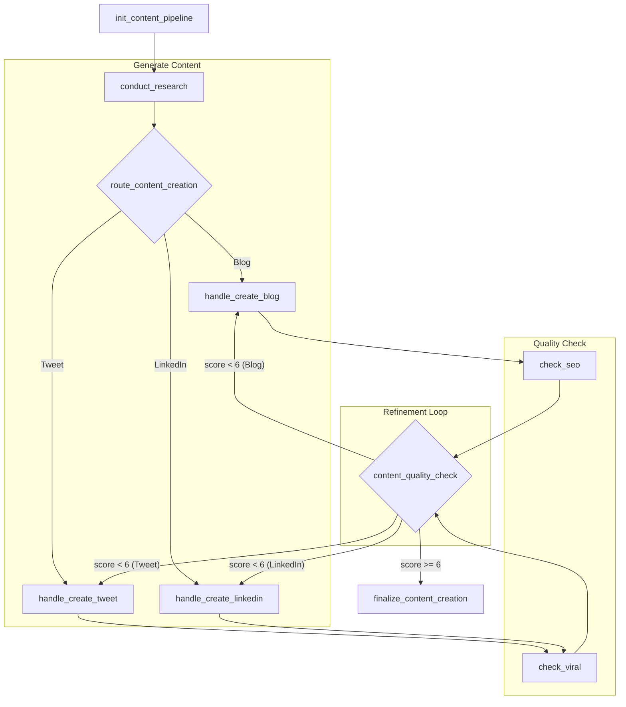

# CrewAI Content Pipeline (AI 콘텐츠 생성 및 품질 개선 자동화 에이전트)

CrewAI의 `flow` 기능을 활용하여 구현한 AI 기반 콘텐츠 생성 및 최적화 시스템입니다. 이 프로젝트는 단순한 텍스트 생성을 넘어, 주어진 주제에 대한 리서치, 콘텐츠 초안 작성, 플랫폼별(SEO/바이럴) 품질 평가, 그리고 평가 점수에 기반한 **자동 반복 개선**까지의 복합적인 워크플로우를 자동화합니다.

## 📋 핵심 기능

이 프로젝트는 3개의 전문화된 AI 에이전트(크루 포함)가 협력하여 7단계의 정교한 프로세스를 수행합니다:

1.  **파이프라인 초기화**: 사용자가 입력한 주제(`topic`)와 콘텐츠 유형(`content_type`)의 유효성을 검사하고, 플랫폼에 맞는 최대 글자 수를 설정합니다.
2.  **자동 리서치**: 지정된 주제에 대한 최신 정보를 웹에서 수집하여 콘텐츠의 깊이와 정확성을 확보합니다.
3.  **콘텐츠 초안 생성**: 리서치 자료를 바탕으로 `Tweet`, `Blog Post`, `LinkedIn Post` 등 지정된 형식의 초안을 생성합니다.
4.  **플랫폼별 품질 평가**:
    - **블로그**: `SeoCrew`가 SEO 점수(1-10점)를 평가합니다.
    - **트윗/링크드인**: `ViralityCrew`가 바이럴 점수(1-10점)를 평가합니다.
5.  **품질 검증 및 반복 개선 (Refinement Loop)**: 평가 점수가 기준(현재 6점)에 미달할 경우, **초안 생성** 단계로 돌아가 개선된 버전을 다시 생성합니다. 이 과정은 품질 기준을 통과할 때까지 자동으로 반복됩니다.
6.  **최종 콘텐츠 확정**: 품질 기준을 통과한 콘텐츠를 최종본으로 확정합니다.
7.  **결과물 저장**: 최종 콘텐츠와 품질 점수, 생성 시간 등 메타데이터를 포함한 결과 파일을 `output/` 디렉토리에 저장합니다.

## 🤖 워크플로우

프로젝트는 CrewAI `flow`를 사용하여 다음 7단계의 태스크를 순차 및 조건부로 실행합니다.



### 태스크 실행 순서

1.  **`init_content_pipeline` (파이프라인 초기화)**
    - `topic`, `content_type` 입력 값을 검증하고 초기 상태를 설정합니다.
2.  **`conduct_research` (주제 리서치)**
    - `Researcher` 에이전트가 주제에 대한 웹 리서치를 수행합니다.
    - **출력**: `state.research` (리서치 결과 텍스트)
3.  **`route_content_creation` (콘텐츠 생성 분기)**
    - `content_type`에 따라 `create_tweet`, `create_blog`, `create_linkedin` 중 적절한 이벤트로 분기합니다.
4.  **`handle_create_*` (콘텐츠 초안 작성)**
    - 리서치 자료를 기반으로 각 플랫폼에 맞는 콘텐츠 초안을 생성합니다.
    - **출력**: `state.tweet`, `state.blog_post`, 또는 `state.linkedin_post` (Pydantic 모델)
5.  **`check_seo` / `check_viral` (품질 평가)**
    - `SeoCrew` 또는 `ViralityCrew`가 초안을 평가합니다.
    - **출력**: `state.score` (점수와 평가 이유가 담긴 `Score` Pydantic 모델)
6.  **`content_quality_check` (품질 검증 및 반복 분기)**
    - `state.score`를 확인하여 기준 점수 미달 시 `reproduce_*` 이벤트를 발생시켜 **4단계**로 돌아가고, 충족 시 `finalize` 이벤트로 넘어갑니다.
7.  **`finalize_content_creation` (최종 결과물 저장)**
    - 최종 확정된 콘텐츠와 메타데이터를 `output/` 디렉토리에 텍스트 파일로 저장합니다.

## 🛠 기술 스택 및 주요 구현

- **CrewAI (`flow`)**: 멀티 에이전트 오케스트레이션 및 복잡한 조건부 워크플로우 관리를 위한 핵심 프레임워크.
- **LLM**: `OpenAI o4-mini`
- **Pydantic**: `ContentPipelineState`, `BlogPost`, `Score` 등 정교한 데이터 모델을 정의하여 워크플로우 전반의 데이터 흐름을 안정적으로 관리.
- **Firecrawl (v2 SDK)**: `web_search_tool`에서 웹 페이지 검색 및 콘텐츠 추출.
- **`@start`, `@listen`, `@router` 데코레이터**: CrewAI `flow`의 핵심 기능으로, 각 함수의 실행 조건과 흐름을 선언적으로 정의.
- **품질 기반 반복 루프**: `@router`를 사용하여 점수에 따라 워크플로우를 동적으로 분기시키고, 결과물이 품질 기준을 만족할 때까지 특정 단계를 반복 실행하는 자동화된 개선 로직 구현.
- **구조화된 LLM 출력**: `LLM` 호출 시 `response_format`에 Pydantic 모델을 지정하여, LLM의 출력을 안정적인 구조화된 객체로 직접 변환.

## 🤖 에이전트 구성

### 1. 리서처 (Researcher)

- **역할**: 디지털 탐정 (Head Researcher)
- **목표**: 주어진 주제에 대한 흥미롭고 유용한 정보를 웹에서 찾아내어 콘텐츠의 기반을 마련합니다.
- **구현 위치**: `main.py`의 `conduct_research` 메서드
- **담당 태스크**: `conduct_research`

### 2. SEO 크루 (SeoCrew)

- **역할**: 까다로운 SEO 전문가 (SEO Specialist)
- **목표**: 블로그 게시물의 검색 엔진 노출을 극대화하기 위해 SEO 품질을 엄격하게 분석하고 점수와 개선점을 제공합니다.
- **구현 위치**: `seo_crew.py`
- **담당 태스크**: `check_seo`

### 3. 바이럴 크루 (ViralityCrew)

- **역할**: 소셜 미디어 바이럴 전문가 (Social Media Virality Expert)
- **목표**: 트윗과 링크드인 게시물이 더 많은 사람들에게 도달하고 공유될 수 있도록 바이럴 잠재력을 분석하고 점수와 피드백을 제공합니다.
- **구현 위치**: `virality_crew.py`
- **담당 태스크**: `check_viral`

## 🚀 설치 및 실행

### 1. 환경 설정

```bash
# 저장소 복제 및 이동
git clone https://github.com/your-username/crewai-content-pipeline.git
cd crewai-content-pipeline

# 가상 환경 생성 및 의존성 설치 (uv 사용 권장)
uv venv
uv sync
```

### 2. 환경 변수 설정

`.env` 파일을 생성하고 필요한 API 키를 설정하세요:

```bash
OPENAI_API_KEY="your_openai_api_key_here"
FIRECRAWL_API_KEY="your_firecrawl_api_key_here"
```

### 3. 실행

`main.py` 파일 하단의 `kickoff` 메서드 호출 부분에서 `content_type`과 `topic`을 수정한 후, 아래 명령어로 실행합니다.

```python
# main.py
flow = ContentPipelineFlow().kickoff(
    inputs={
        "content_type": ContentType.TWEET,
        "topic": "Chainsaw Man: Reze Arc is fire",
    }
)
```

```bash
# 메인 스크립트 실행
uv run python main.py
```

## 📁 프로젝트 구조

```
crewai-content-pipeline/
├── main.py              # 메인 워크플로우(ContentPipelineFlow) 정의 및 실행
├── seo_crew.py          # SEO 평가 크루 정의
├── virality_crew.py     # 바이럴 평가 크루 정의
├── tools.py             # 웹 검색 도구(web_search_tool) 정의
├── output/              # 최종 결과물 저장 디렉토리
│   └── *.txt
├── pyproject.toml       # 프로젝트 의존성
├── .env                 # 환경 변수
└── README.md
```

## 💻 최종 결과물

실행이 완료되면 `output/` 디렉토리에 `{content_type}_{timestamp}.txt` 형식의 파일이 생성됩니다. 이 파일에는 다음과 같은 정보가 포함됩니다:

- 주제 (Topic)
- 콘텐츠 유형 (Content Type)
- 최종 품질 점수 (Quality Score)
- 점수 산정 이유 (Score Reason)
- 생성 시각 (Generated At)
- 최종 콘텐츠 본문
