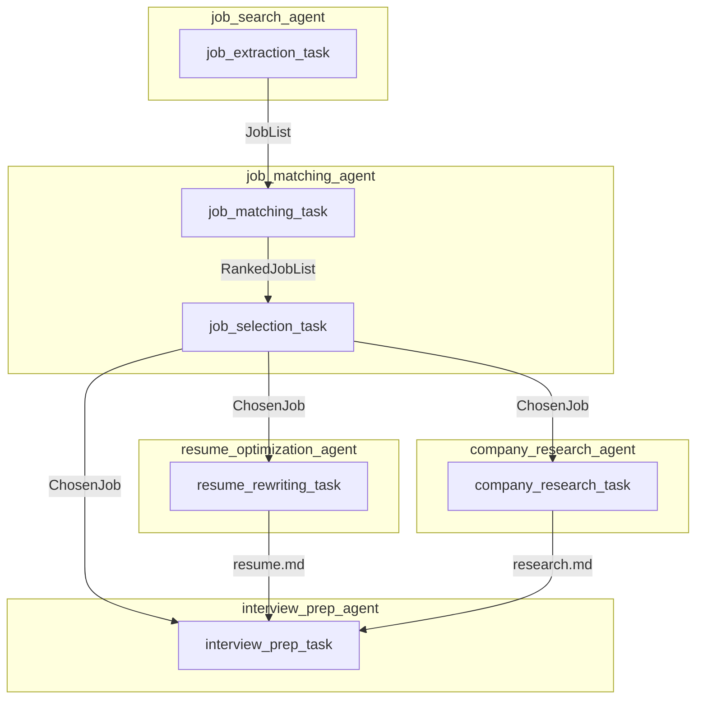

# CrewAI Job Hunter (AI 채용 공고 탐색 및 맞춤 지원 자료 생성 에이전트)

CrewAI 프레임워크를 활용하여 구현한 AI 기반 채용 공고 탐색, 분석 및 맞춤형 지원 자료 생성 시스템입니다. 이 프로젝트는 단순한 공고 검색을 넘어, 사용자의 이력서와 가장 적합한 단일 포지션을 선별하고, 해당 포지션에 맞춰 이력서를 최적화하며, 심층적인 기업 분석과 맞춤형 면접 준비 자료까지 생성하는 복합적인 워크플로우를 자동화합니다.

## 📋 핵심 기능

이 프로젝트는 5개의 전문화된 AI 에이전트가 협력하여 6단계의 정교한 프로세스를 수행합니다:

1.  **채용 공고 검색**: 사용자가 지정한 키워드(직무, 경력 수준, 지역)에 맞춰 웹에서 관련 채용 공고를 대량으로 수집합니다.
2.  **공고-이력서 매칭**: 수집된 공고와 사용자 이력서를 비교 분석하여 각 공고의 적합도를 점수(1-5점)로 평가합니다.
3.  **최적 공고 선택**: 평가된 공고 목록 중 가장 적합도가 높은 **단 하나의 공고**를 최종 선택합니다.
4.  **이력서 최적화**: 선택된 공고에 맞춰 사용자의 기존 이력서를 재작성하여 해당 직무에 가장 매력적으로 보이도록 최적화합니다.
5.  **기업 리서치**: 선택된 공고의 기업에 대해 심층적으로 조사하여 기업 문화, 미션, 최신 동향 등을 파악합니다.
6.  **면접 준비 자료 생성**: 위의 모든 정보(공고, 최적화된 이력서, 기업 리서치)를 종합하여 맞춤형 면접 질문, 답변 전략, 어필 포인트 등을 담은 최종 면접 준비 문서를 생성합니다.

## 🤖 워크플로우

프로젝트는 다음 6단계의 태스크를 순차 및 병렬로 실행합니다.



### 태스크 실행 순서

1.  **`job_extraction_task` (채용 공고 검색)**

    - 지정된 키워드로 채용 공고를 검색하여 목록을 생성합니다.
    - **출력**: `JobList` (Pydantic 구조화된 데이터)

2.  **`job_matching_task` (공고 매칭 및 점수화)**

    - 1단계의 공고 목록과 이력서를 비교하여 각 공고의 적합도 점수를 매깁니다.
    - **출력**: `RankedJobList` (Pydantic 구조화된 데이터)

3.  **`job_selection_task` (최적 공고 선택)**

    - 2단계의 점수화된 목록 중 가장 적합한 단일 공고를 선택합니다.
    - **출력**: `ChosenJob` (Pydantic 구조화된 데이터)

4.  **병렬 처리 단계**

    - **`resume_rewriting_task` (이력서 최적화)**
      - 선택된 공고에 맞춰 이력서를 최적화하고 `output/rewritten_resume.md`를 생성합니다.
      - **종속성**: `job_selection_task` 결과 필요
    - **`company_research_task` (기업 리서치)**
      - 선택된 공고의 기업을 조사하고 `output/company_research.md`를 생성합니다.
      - **종속성**: `job_selection_task` 결과 필요

5.  **`interview_prep_task` (최종 면접 준비 자료 생성)**
    - 선택된 공고, 최적화된 이력서, 기업 리서치 내용을 종합하여 `output/interview_prep.md`를 생성합니다.
    - **종속성**: `job_selection_task`, `resume_rewriting_task`, `company_research_task` 모든 결과 필요

## 🛠 기술 스택 및 주요 구현

- **CrewAI & LangChain**: 멀티 에이전트 오케스트레이션 및 LLM 연동
- **LLM**: `OpenAI o4-mini-2025-04-16`
- **Pydantic**: `Job` 모델에 포함된 수십 개의 상세 필드를 통해 정교한 데이터 구조화 및 안정적인 출력 관리
- **Firecrawl (v2 SDK)**: 웹 검색 및 스크래핑
- **YAML 설정**: 에이전트와 태스크의 역할을 분리하여 유연성 및 유지보수성 증대
- **비선형 태스크 체이닝**: `context` 파라미터를 활용하여 여러 태스크의 결과물을 후속 태스크에 동시 전달하는 복잡한 워크플로우 구현
- **동적 파일 출력**: `output_file` 및 `create_directory` 기능을 사용하여 각 태스크의 결과물을 체계적으로 저장

## 🤖 에이전트 구성

### 1. 채용 공고 검색 에이전트 (Job Search Agent)

- **역할**: 숙련된 채용 시장 리서치 전문가
- **목표**: 사용자가 지정한 조건에 맞는 채용 공고를 웹에서 효율적으로 검색하고 수집합니다.
- **담당 태스크**: `job_extraction_task`

### 2. 채용 공고 매칭 에이전트 (Job Matching Agent)

- **역할**: 지능형 직무 매칭 평가관
- **목표**: 수집된 공고 목록과 사용자 이력서를 비교하여, 각 공고의 적합도를 점수화하고 최고의 기회를 선별합니다.
- **담당 태스크**: `job_matching_task`, `job_selection_task`

### 3. 이력서 최적화 에이전트 (Resume Optimization Agent)

- **역할**: 이력서 최적화 전문가
- **목표**: 선택된 단일 채용 공고에 맞춰 사용자의 이력서를 재작성하여 서류 통과율을 극대화합니다.
- **담당 태스크**: `resume_rewriting_task`

### 4. 기업 리서치 에이전트 (Company Research Agent)

- **역할**: 기업 분석 및 면접 전략가
- **목표**: 지원할 기업을 심층 분석하여 후보자가 면접에서 전략적 우위를 점할 수 있도록 돕습니다.
- **담당 태스크**: `company_research_task`

### 5. 면접 준비 에이전트 (Interview Prep Agent)

- **역할**: 면접 전략 및 준비 코치
- **목표**: 모든 가용 데이터(공고, 이력서, 기업 정보)를 종합하여 최종 면접 준비 브리핑 자료를 생성합니다.
- **담당 태스크**: `interview_prep_task`

## 🚀 설치 및 실행

### 1. 환경 설정

```bash
# 저장소 복제 및 이동
git clone https://github.com/your-username/crewai-job-hunter.git
cd crewai-job-hunter

# 가상 환경 생성 및 의존성 설치 (uv 사용 권장)
uv venv
uv sync
```

### 2. 환경 변수 설정

`.env` 파일을 생성하고 필요한 API 키를 설정하세요:

```bash
OPENAI_API_KEY="your_openai_api_key_here"
FIRECRAWL_API_KEY="your_firecrawl_api_key_here"
```

### 3. 이력서 준비

`knowledge/resume.txt` 파일에 자신의 최신 이력서 내용을 붙여넣습니다. 에이전트는 이 파일을 기반으로 모든 분석을 수행합니다.

### 4. 실행

`main.py` 파일 상단의 `inputs` 딕셔너리에서 원하는 직무, 경력 수준, 위치를 수정한 후, 아래 명령어로 실행합니다.

```python
# main.py
inputs = {
    "position": "Senior Python Developer",
    "location": "Remote",
    "level": "Senior",
}
```

```bash
# 메인 스크립트 실행
uv run python main.py
```

## 📁 프로젝트 구조

```
crewai-job-hunter/
├── main.py              # 메인 실행 스크립트
├── tools.py             # 커스텀 도구 (웹 검색, 파일 쓰기 등)
├── models.py            # Pydantic 데이터 모델 (Job, JobList 등)
├── config/
│   ├── agents.yaml      # 에이전트 설정
│   └── tasks.yaml       # 태스크 설정
├── knowledge/
│   └── resume.txt       # 사용자 이력서 파일
├── output/              # 최종 결과물 저장 디렉토리
│   ├── rewritten_resume.md
│   ├── company_research.md
│   └── interview_prep.md
├── pyproject.toml       # 프로젝트 의존성
└── .env                 # 환경 변수
```

## 💻 최종 결과물

실행이 완료되면 `output/` 디렉토리에 다음과 같은 3개의 마크다운 파일이 생성됩니다.

1.  **`rewritten_resume.md`**: 선택된 공고에 맞춰 새롭게 최적화된 이력서.
2.  **`company_research.md`**: 지원할 기업에 대한 상세 분석 리포트.
3.  **`interview_prep.md`**: 예상 질문, 전략, 어필 포인트 등이 담긴 맞춤형 면접 준비 가이드.

## 📚 학습 포인트

- **복잡한 워크플로우 설계**: 5개의 에이전트와 6개의 태스크를 비선형적으로 연결하여 실제 문제 해결에 가까운 시스템 구축.
- **Pydantic을 활용한 LLM 출력 제어**: 수십 개의 상세 필드를 가진 Pydantic 모델을 `output_pydantic`으로 지정하여, LLM의 출력을 안정적이고 구조화된 데이터로 변환.
- **컨텍스트 기반 태스크 실행**: 여러 선행 태스크의 결과물을 `context`로 받아 후속 태스크를 수행하는 고급 CrewAI 패턴 활용.
- **실용적인 결과물 생성**: 단순 정보 조회를 넘어, 실제 구직 활동에 직접 사용할 수 있는 구체적인 결과물(이력서, 분석 리포트, 면접 자료)을 생성.
- **모듈화된 설계**: `agents.yaml`, `tasks.yaml`을 통해 에이전트와 태스크의 로직을 분리하여 재사용성과 확장성을 확보.
