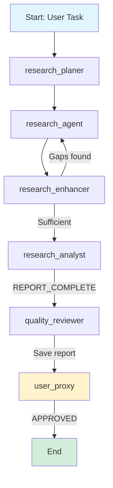
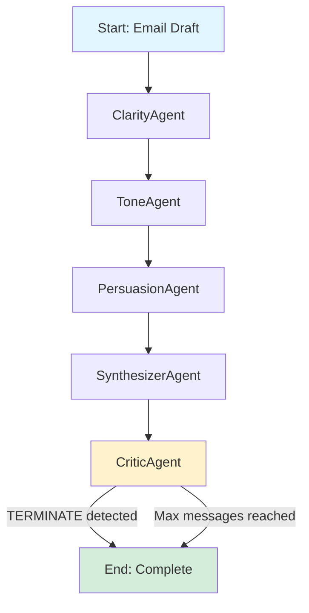

# MS Agent Deep Research (Microsoft Agent Framework를 활용한 심층 리서치 및 이메일 최적화 에이전트)

Microsoft의 새로운 **Agent Framework**를 사용하여 두 가지의 독립적인 멀티 에이전트 시스템을 구현한 프로젝트입니다. 하나는 주어진 주제에 대해 심층적인 자율 리서치를 수행하고 보고서를 생성하며, 다른 하나는 전문가 에이전트들의 협업을 통해 이메일 초안을 반복적으로 개선합니다.

> **Note**: 이 프로젝트는 AutoGen 기반의 [autogen-deep-research](../autogen-deep-research/)에서 Microsoft Agent Framework로 마이그레이션된 버전입니다. AutoGen은 더 이상 새로운 기능이 추가되지 않으며, Microsoft Agent Framework가 공식 후속 프레임워크입니다.

## 🚀 핵심 프로젝트

이 저장소는 두 개의 주요 노트북 파일로 구성됩니다.

### 1. 심층 리서치 에이전트 (`deep-research.ipynb`)

- **목표**: 사용자가 입력한 주제에 대해 계획, 리서치, 분석, 검토의 전 과정을 자동화하여 고품질의 리서치 보고서를 생성합니다.
- **핵심 기능**:
  - **그래프 기반 워크플로우**: Agent Framework의 `Workflow` API를 사용하여 데이터 플로우 기반의 결정론적 워크플로우를 구현합니다.
  - **스트리밍 및 체크포인팅**: 중간 상태를 저장하고 필요 시 재개할 수 있는 체크포인트 기능을 활용합니다.
  - **자동 리서치 및 강화**: 리서치 계획을 수립하고 웹 검색을 수행한 후, 결과물의 허점을 파악하여 추가 리서치를 진행하는 `Enhancer` 에이전트가 포함됩니다.
  - **보고서 생성 및 저장**: 분석가 에이전트가 종합 보고서를 작성하면, 품질 검토 에이전트가 이를 평가하고 최종 결과물을 `.md` 파일로 저장합니다.
  - **Human-in-the-Loop**: 최종 승인 단계에서 사용자가 개입하여 결과물을 검토하거나 추가 작업을 요청할 수 있습니다.
  - **관찰성(Observability)**: OpenTelemetry 통합을 통해 에이전트 실행 과정을 추적하고 디버깅할 수 있습니다.

### 2. 이메일 최적화 에이전트 (`email_optimizer.py`)

- **목표**: 간단한 이메일 초안을 명료성, 어조, 설득력 측면에서 전문가 에이전트들이 순차적으로 개선하여 최종 결과물을 완성합니다.
- **핵심 기능**:
  - **순차 워크플로우(Sequential Workflow)**: `SequentialBuilder`를 사용하여 에이전트들이 공유 대화 컨텍스트에 순차적으로 응답을 추가하는 방식으로 동작합니다.
  - **전문가 역할 분담**: 각 에이전트는 명료성(Clarity), 어조(Tone), 설득력(Persuasion) 등 하나의 전문 분야에만 집중하여 초안을 수정합니다.
  - **미들웨어 기반 종료 조건**: 커스텀 `TerminationMiddleware`가 최대 메시지 수와 "TERMINATE" 키워드를 감지하여 워크플로우를 제어합니다.
  - **스트리밍 실행**: `workflow.run_stream()`을 통해 워크플로우 이벤트를 실시간으로 처리하고 최종 결과를 `WorkflowOutputEvent`로 수신합니다.

**마이그레이션 하이라이트 (AutoGen → MS Agent Framework)**:

- `RoundRobinGroupChat` → `SequentialBuilder`: 순차적 에이전트 실행 패턴
- `AssistantAgent` → `ChatAgent`: 에이전트 클래스 변경, `model_client` → `chat_client`, `system_message` → `instructions`
- `OpenAIChatCompletionClient` → `OpenAIChatClient`: 모델 클라이언트 변경
- `TextMentionTermination` & `MaxMessageTermination` → `TerminationMiddleware`: 종료 조건을 미들웨어 패턴으로 구현
- `Console(team.run_stream())` → `workflow.run_stream()`: 워크플로우 실행 및 이벤트 처리 방식 변경

## 🤖 워크플로우

각 프로젝트는 Microsoft Agent Framework의 그래프 기반 워크플로우를 활용합니다.

### Deep Research 워크플로우 (Graph-based Workflow)



### Email Optimizer 워크플로우 (Sequential Workflow)



**워크플로우 설명**:

- AutoGen 버전과 달리, MS Agent Framework의 `SequentialBuilder`는 단일 패스로 에이전트들을 순차 실행합니다.
- `TerminationMiddleware`가 "TERMINATE" 키워드 또는 최대 메시지 수를 감지하여 워크플로우를 종료합니다.
- 반복 실행이 필요한 경우, 애플리케이션 레벨에서 워크플로우를 재시작할 수 있습니다.

## 🛠 기술 스택 및 주요 구현

- **Microsoft Agent Framework**: 멀티 에이전트 워크플로우 및 오케스트레이션을 위한 차세대 프레임워크 (AutoGen의 공식 후속)
  - **Graph-based Workflows**: 데이터 플로우 기반의 결정론적 워크플로우로 에이전트들을 연결합니다.
  - **Middleware System**: 요청/응답 처리, 예외 핸들링, 커스텀 파이프라인 구현을 위한 미들웨어를 제공합니다.
  - **Streaming & Checkpointing**: 실시간 스트리밍과 상태 저장/복원 기능을 지원합니다.
  - **OpenTelemetry Integration**: 내장된 관찰성 기능으로 에이전트 실행을 모니터링합니다.
- **LLM**: OpenAI `gpt-4o`, `gpt-4o-mini` 또는 Azure OpenAI Service
- **Tools Integration**: 웹 검색, 파일 I/O 등의 도구를 에이전트에 연결할 수 있습니다.
- **JupyterLab**: 노트북 환경에서 에이전트 시스템을 개발하고 실행합니다.

## 🔄 AutoGen에서의 주요 변경 사항

Microsoft Agent Framework로 마이그레이션하면서 다음과 같은 주요 변경이 이루어졌습니다:

| 항목                  | AutoGen                                                  | Microsoft Agent Framework                                |
| --------------------- | -------------------------------------------------------- | -------------------------------------------------------- |
| **워크플로우 패턴**   | `SelectorGroupChat`, `RoundRobinGroupChat` (이벤트 기반) | `SequentialBuilder`, `GraphBuilder` (데이터 플로우 기반) |
| **에이전트 클래스**   | `AssistantAgent` (with `model_client`, `system_message`) | `ChatAgent` (with `chat_client`, `instructions`)         |
| **모델 클라이언트**   | `OpenAIChatCompletionClient`                             | `OpenAIChatClient`                                       |
| **종료 조건**         | `TextMentionTermination`, `MaxMessageTermination`        | 커스텀 `AgentMiddleware` 구현                            |
| **워크플로우 실행**   | `Console(team.run_stream())`                             | `workflow.run_stream()` with `WorkflowOutputEvent`       |
| **미들웨어**          | 없음                                                     | 내장 미들웨어 시스템 제공                                |
| **관찰성**            | 기본 로깅                                                | OpenTelemetry 통합                                       |
| **체크포인팅**        | 제한적                                                   | 네이티브 지원 (상태 저장/복원)                           |
| **Human-in-the-Loop** | `UserProxyAgent`                                         | Workflow interruption + approval nodes                   |
| **엔터프라이즈 기능** | 실험적                                                   | 프로덕션 준비 완료 (CI/CD, 컨테이너 배포)                |

**마이그레이션 이점**:

- 더 예측 가능하고 디버깅이 쉬운 워크플로우
- 엔터프라이즈 환경에 적합한 관찰성 및 모니터링
- 클라우드 네이티브 배포 지원 (Kubernetes, Docker, Serverless)
- Microsoft의 장기 지원 및 새로운 기능 추가

**Email Optimizer 마이그레이션 특징**:

AutoGen의 `email-optimizer.ipynb`에서 MS Agent Framework의 `email_optimizer.py`로 마이그레이션하면서:

1. **워크플로우 아키텍처**: `RoundRobinGroupChat` → `SequentialBuilder`로 변경하여 에이전트들이 공유 대화 컨텍스트(`list[ChatMessage]`)에 순차적으로 응답을 추가하는 방식으로 구현
2. **에이전트 정의**: `AssistantAgent` → `ChatAgent`로 변경, 파라미터명 변경 (`model_client` → `chat_client`, `system_message` → `instructions`)
3. **종료 조건**: AutoGen의 선언적 종료 조건(`TextMentionTermination | MaxMessageTermination`)을 `TerminationMiddleware` 클래스로 재구현하여 미들웨어 패턴 활용
4. **실행 패턴**: `Console(team.run_stream())`을 `workflow.run_stream()`으로 대체하고, `WorkflowOutputEvent`를 통해 최종 대화 이력 수신
5. **철학적 변화**: AutoGen의 이벤트 기반 그룹 채팅에서 MS Agent Framework의 명시적 데이터 플로우 중심 워크플로우로 전환하여 더 예측 가능하고 디버깅이 용이한 구조로 개선

## 🤖 에이전트 구성

### Deep Research 에이전트

- **`research_planer`**: 복잡한 질문을 하위 리서치 작업으로 분해하고 구체적인 검색 쿼리를 생성합니다.
- **`research_agent`**: 생성된 쿼리를 사용하여 웹 검색을 수행하고 정보를 추출합니다.
- **`research_enhancer`**: 리서치 결과의 중대한 허점을 식별하고 필요한 경우 추가 검색을 제안합니다.
- **`research_analyst`**: 수집된 정보를 바탕으로 체계적인 종합 보고서를 작성합니다.
- **`quality_reviewer`**: 보고서의 완성도와 정확성을 평가하고, 기준 충족 시 파일로 저장합니다.
- **`user_proxy`**: 최종 결과물을 검토하고 승인하는 인간 사용자의 역할을 대리합니다.

### Email Optimizer 에이전트

- **`ClarityAgent`**: 모호함과 군더더기를 제거하여 메시지를 명확하고 간결하게 만듭니다.
- **`ToneAgent`**: 이메일의 어조를 청중에게 맞게 따뜻하고 전문적으로 다듬습니다.
- **`PersuasionAgent`**: 행동 유도(CTA)를 강화하고 논리를 보강하여 설득력을 높입니다.
- **`SynthesizerAgent`**: 이전 에이전트들의 제안을 종합하여 통일성 있는 최종 초안을 작성합니다.
- **`CriticAgent`**: 최종 초안의 품질을 평가하고, 기준에 미치지 못하면 수정을 지시하고, 만족하면 프로세스를 종료합니다.

## 🚀 설치 및 실행

### 1. 환경 설정

```bash
# 저장소 복제 및 이동
git clone https://github.com/your-username/ms-agent-deep-research.git
cd ms-agent-deep-research

# 가상 환경 생성 및 의존성 설치 (uv 사용 권장)
uv venv
uv sync
```

### 2. Microsoft Agent Framework 설치

```bash
# Python 환경에 Agent Framework 설치
uv pip install agent-framework --pre

# 또는 pip 사용
pip install agent-framework --pre
```

### 3. 환경 변수 설정

`.env` 파일을 생성하고 필요한 API 키를 설정하세요:

```bash
# OpenAI API (또는 Azure OpenAI Service)
OPENAI_API_KEY="your_openai_api_key_here"

# 웹 검색 도구 (선택사항)
FIRECRAWL_API_KEY="your_firecrawl_api_key_here"

# Azure OpenAI를 사용하는 경우
# AZURE_OPENAI_API_KEY="your_azure_openai_key"
# AZURE_OPENAI_ENDPOINT="https://your-resource.openai.azure.com/"
# AZURE_OPENAI_DEPLOYMENT_NAME="gpt-4o"
```

### 4. 실행

JupyterLab을 실행하여 노트북을 실행하거나, Python 스크립트를 직접 실행합니다.

```bash
# JupyterLab 실행 (노트북 파일용)
uv run jupyter lab
```

- **`deep-research.ipynb`**: 마지막 셀의 `task` 변수에 리서치할 주제를 입력하고 실행합니다.

**또는 Python 스크립트 직접 실행**:

```bash
# 이메일 최적화 에이전트 실행
uv run python email_optimizer.py
```

- **`email_optimizer.py`**: 스크립트 내의 `test_email` 변수를 수정하여 최적화할 이메일 초안을 입력하고 실행합니다.

## 📁 프로젝트 구조

```
ms-agent-deep-research/
├── .env               # 환경 변수
├── .python-version    # 파이썬 버전
├── email_optimizer.py # 이메일 최적화 에이전트
├── pyproject.toml     # 프로젝트 의존성
├── README.md          # 프로젝트 문서
├── uv.lock            # uv 잠금 파일
└── .venv/             # 가상 환경
```

**주요 파일 설명**:

- `email_optimizer.py`: 전문가 에이전트들의 협업을 통해 이메일 초안을 반복적으로 개선하는 에이전트입니다.

## 💻 최종 결과물

- **`deep-research.ipynb`**: 실행이 완료되면 프로젝트 루트 디렉토리에 `report.md` 파일이 생성됩니다.
- **`email_optimizer.py`**: 최종적으로 개선된 이메일 텍스트와 전체 대화 이력이 콘솔에 출력됩니다.

## 🔍 Email Optimizer 마이그레이션 핵심 개념

### 1. 워크플로우 패러다임 변화

**AutoGen (이벤트 기반)**:

```python
# RoundRobinGroupChat: 에이전트들이 순차적으로 대화에 참여
team = RoundRobinGroupChat(
    participants=[clarity_agent, tone_agent, ...],
    termination_condition=text_termination | max_message_termination
)
await Console(team.run_stream(task="..."))
```

**MS Agent Framework (데이터 플로우 기반)**:

```python
# SequentialBuilder: 명시적 순차 워크플로우
workflow = SequentialBuilder().participants([clarity_agent, tone_agent, ...]).build()
async for event in workflow.run_stream(email_draft):
    if isinstance(event, WorkflowOutputEvent):
        conversation_history = event.data  # list[ChatMessage]
```

### 2. 에이전트 정의 변화

**AutoGen**:

```python
clarity_agent = AssistantAgent(
    name="ClarityAgent",
    model_client=OpenAIChatCompletionClient(model="gpt-4o-mini"),
    system_message="You are an expert editor..."
)
```

**MS Agent Framework**:

```python
clarity_agent = ChatAgent(
    name="ClarityAgent",
    chat_client=OpenAIChatClient(model_id="gpt-4o-mini"),
    instructions="You are an expert editor...",
    middleware=[termination_middleware]
)
```

### 3. 종료 조건 구현

**AutoGen (선언적)**:

```python
text_termination = TextMentionTermination(text="TERMINATE")
max_message_termination = MaxMessageTermination(max_messages=30)
termination_conditions = text_termination | max_message_termination
```

**MS Agent Framework (미들웨어 패턴)**:

```python
class TerminationMiddleware(AgentMiddleware):
    async def process(self, context: AgentRunContext, next) -> None:
        self.message_count += 1
        if self.message_count >= self.max_messages:
            context.terminate = True
            return
        await next(context)
        if "TERMINATE" in str(context.result):
            context.terminate = True
```

### 4. 철학적 차이

| 측면             | AutoGen                    | MS Agent Framework              |
| ---------------- | -------------------------- | ------------------------------- |
| **제어 흐름**    | 암묵적, 이벤트 기반        | 명시적, 데이터 플로우 기반      |
| **예측 가능성**  | LLM이 대화 흐름 일부 제어  | 개발자가 완전히 제어            |
| **디버깅**       | 대화 흐름 추적이 어려움    | 워크플로우 그래프로 명확한 추적 |
| **확장성**       | 복잡한 시나리오에서 제한적 | 미들웨어와 그래프로 유연한 확장 |
| **엔터프라이즈** | 실험적 단계                | 프로덕션 준비 완료              |

## 📚 참고 자료

- [Microsoft Agent Framework 공식 문서](https://learn.microsoft.com/en-us/agent-framework/)
- [AutoGen에서 마이그레이션 가이드](https://learn.microsoft.com/en-us/agent-framework/migration-guide/from-autogen/)
- [Agent Framework GitHub 저장소](https://github.com/microsoft/agent-framework)
- [원본 AutoGen 프로젝트](../autogen-deep-research/)

## 🔍 주요 특징

### 1. 프로덕션 준비 완료

- OpenTelemetry를 통한 내장 관찰성
- 미들웨어 시스템을 통한 예외 처리 및 로깅
- 체크포인팅을 통한 장애 복구

### 2. 엔터프라이즈 친화적

- 클라우드 네이티브 배포 지원 (Docker, Kubernetes)
- CI/CD 파이프라인 통합 가능
- Azure, AWS, GCP 등 다양한 클라우드 플랫폼 지원

### 3. 개발자 경험

- DevUI를 통한 대화형 개발 및 디버깅
- 그래프 기반 워크플로우로 직관적인 시각화
- Python과 .NET 모두 지원

## ⚠️ 알려진 제한 사항

- Microsoft Agent Framework는 현재 프리뷰 단계이므로 API가 변경될 수 있습니다.
- 일부 AutoGen의 고급 기능(예: 동적 그룹 채팅)은 명시적 워크플로우 그래프로 재구현해야 합니다.
- 프로덕션 배포 시 OpenTelemetry 백엔드(Jaeger, Zipkin 등) 설정이 권장됩니다.

## 📝 라이선스

이 프로젝트는 MIT 라이선스 하에 배포됩니다.

---

**Note**: AutoGen은 Microsoft에 의해 유지보수 모드로 전환되었으며, 버그 수정 및 보안 패치만 제공됩니다. 새로운 프로젝트는 Microsoft Agent Framework를 사용하는 것이 권장됩니다.
